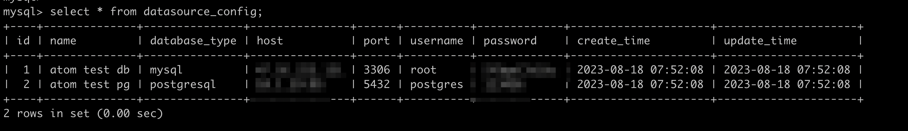
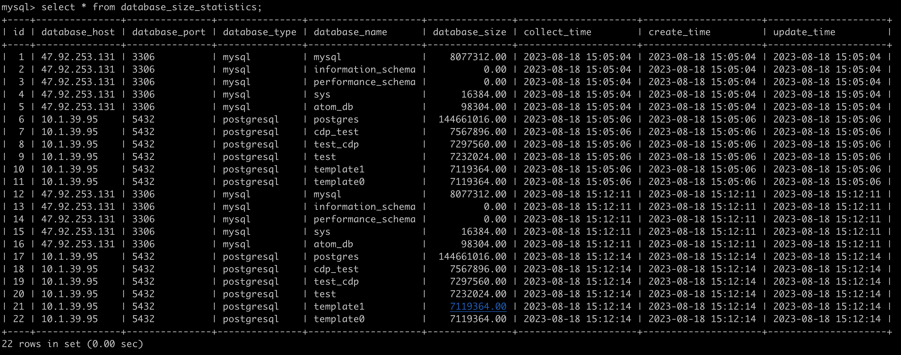

# 计算数据库存储占用空间大小

1. 目前支持mysql，PostgresSQL两种数据库类型，架构设计遵循开闭原则，支持动态扩展
2. 使用三方调度系统控制统计频率

# SQL脚本位置

```shell
./sql
```

# 系统入口

```java
src/main/java/com/atom/statistics/controller/StorageStatisticsController.java  
```

# 测试方式

```shell
curl --location 'localhost:8080/statistics/calculate'
```

# 配置信息

```shell
src/main/resources/application.yaml
```

# 表设计

## 采集数据源配置表

```sql
CREATE TABLE if not exists  datasource_config
(
    id            INT PRIMARY KEY AUTO_INCREMENT,
    name          VARCHAR(255) NOT NULL,
    database_type VARCHAR(255) NOT NULL,
    host          VARCHAR(255) NOT NULL,
    port          INT          NOT NULL,
    username      VARCHAR(255) NOT NULL,
    password      VARCHAR(255) NOT NULL,
    create_time   DATETIME    NOT NULL  DEFAULT now(),
    update_time   DATETIME     NOT NULL DEFAULT now() ON UPDATE CURRENT_TIMESTAMP
)engine=innodb DEFAULT CHARSET=utf8mb4 comment '数据源配置表，用于统计，收集数据库磁盘占用';

```

## 数据存储统计表

```sql
create table if not exists database_size_statistics
(
    id            BIGINT auto_increment primary key,
    database_host VARCHAR(255) comment '数据库host',
    database_port VARCHAR(6) comment '数据库port',
    database_type VARCHAR(255) comment '数据库类型',
    database_name VARCHAR(255) comment '数据库名称',
    database_size DECIMAL(20, 2) comment '数据库大小，字节',
    collect_time  DATETIME NOT NULL comment '采集时间',
    create_time   DATETIME DEFAULT now()  comment '创建时间',
    update_time   DATETIME DEFAULT now() comment '更新时间' ON UPDATE CURRENT_TIMESTAMP
) engine=innodb DEFAULT CHARSET=utf8mb4 comment '数据库存储大小统计，按天统计';
```

# 验证截图




# database-logs-statistics
